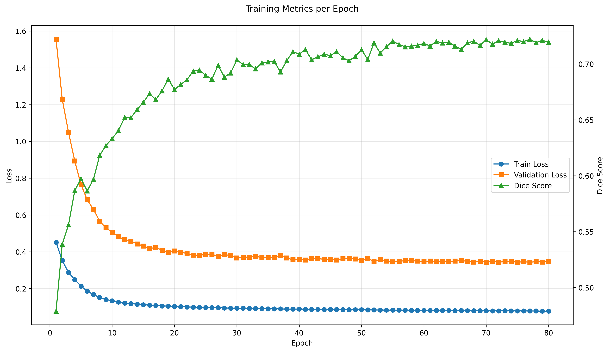
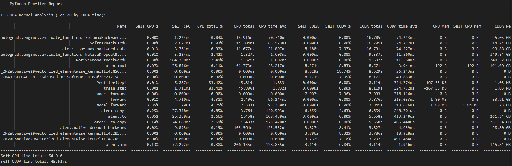
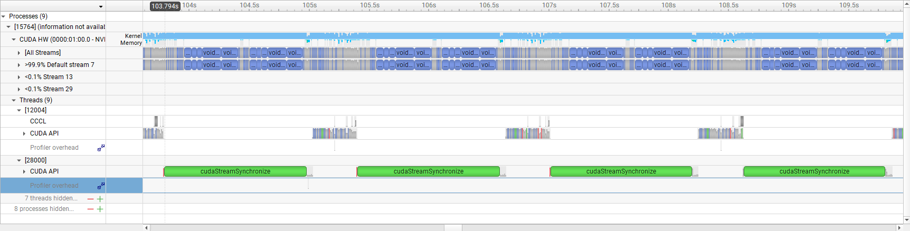
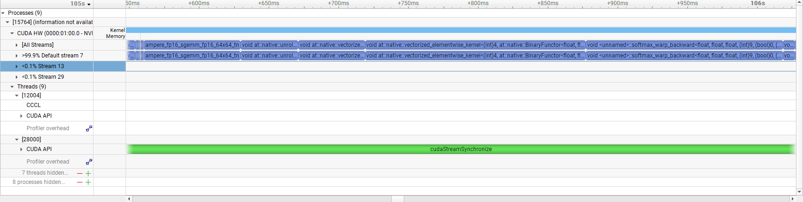

# GPU-Accelerated 3D Vision Transformer for Brain Tumor Segmentation
This is the next stage in my GPU/ML learning journey (see [Real-Time-Webcam-Image-Classification](https://github.com/EricJeong05/Real-Time-Webcam-Image-Classification) for my first project!) where I try and tackle more complex subjects (going from 2D -> 3D images) and work through the entire ML pipeline starting from data preprocessing -> model creation & tuning -> training -> inference -> performance optimization and GPU acceleration!  

## 1 . Visualize the BraTs data to first understand what the data looks like
I used the 2021 BRaTS dataset for this project ([Kaggle link](https://www.kaggle.com/datasets/dschettler8845/brats-2021-task1)). The first step I wanted to do was just see what this dataset even looked like since I've never worked with MRI data before. To do this, view_interactive_4pane_brats.py script loads all 4 of the modalities (T1, T1CE, T2, FLAIR) into one plot and overlays the segmentation masks on top of each to show where the tumor is. 

This script is interactive so that when you use your mouse scroll wheel to scroll up & down, it goes through the slices (z-axis) of the MRI volume.

**<ins>Here's a slice of the volume visualized:</ins>**

## 2. Preprocess the data
The next step is to preprocess the dataset to get it ready for feeding it into the model. For this project I'm preprocessing it in a way that it can be both fed into a UNet model (CNN-based) and a SwinUNETR model (transformer-based). I'm doing this because I want to get experience working with both types of models and I'm curious on how each of model type peforms and how much I can push them.

To allow support for both these models and ease of re-use between them, I've opted to go for a preprocessor script that runs independetly and takes the entire BRaTS dataset, does all of the deterministic preprocessing "offline," and stores each sample in a tensor (.pt) format for easy and quick loading during training.

**<ins>The preprocessing steps include:</ins>**

1. Adding channel dimension
2. Reorient volume to standard axis convention (RAS: Right, Anterior, Superior)
3. Resample to isotropic voxel spacing (e.g., 1mm × 1mm × 1mm) using linear interpolation for images and nearest-neighbor for labels
4. Normalize intensities to 0-1 range per modality
5. Foreground crop to remove empty black space and resize all volumes to 128x128x128
6. Convert labels 0,1,2,4 → 0,1,2,3 for ease of use
7. Ensure labels are int64 (not float64) for training
8. Save as PyTorch tensors (.pt)

**<ins>After preprocessing, the volume looks like such:</ins>**

## 3. Train UNet Model for Baseline DICE
Now once all the preprocessing is complete and we have all the .pt tensors saved, I'm first training a basic 3D U-Net model. The basic UNet architecture is shown below and it was pretty cool to learn about how it all works.

My UNet model has 5 layers, with each layer halving the image size while doubling the channel count, with 2 residual units at each layer.

During each training step, I applied random real-time augmentations to every input tensor to improve training performance. These augmentations include:

1. Random flips (axis-wise)
2. Random rotations (90deg)
3. Random gaussian noise

My training/val/test split was 80/10/10 from the entire Kaggle dataset. I trained the UNet for 200 epochs, with each epoch having 1000 samples to train on, and saved the model with the best DICE score since it's not guarenteed that the most recently trained model provides the best DICE score. After training, my UNet model reached:

- **Training DICE Score = 0.7633**
- **Training Loss = 0.2496**
- **Validation Loss = 0.2990**

Then I loaded in the saved best performing model and ran it through the test dataset and my final model performance on the test set was:

- **Test DICE Score = 0.7616**
- **Test Loss = 0.2947**

As shown in the test DICE score and Loss, it does perform a bit worse compared to the training data, perhaps signaling overfitting to training data, but this is pretty good! State of the art UNet models can reach over DICE scores of 90%+, but as this is a very basic/simple UNet model with limited hardware resources, this is pretty good.

**Total time for training: 7.453 hrs**

Here is a plot of the training and validation loss + DICE score over all the epochs to see how the model faired during training:

Below is a prediction on one of the samples it made compared to the ground truth (side by side per modality):

I wanted to try and improve this model and try and push it as far as I can. The following improvements have been made to both improve training time and overall performance
1. cudnn_checkpointing enabled 
2. gradient accumulation steps = 4
3. DataLoader: prefetch_factor=None, num_workers=8, pin_memory=True, persistent_workers=True
4. Non-blocking transfers to GPU
5. Adam optimizer with fused implementation
6. Clear GPU cache after validation
7. Learning rate scheduler: WarmupCosineSchedule

Applying these changed and training the model for 200 epochs as before yielded the following results:

- **Training DICE Score = 0.7487**
- **Training Loss = 0.0634**
- **Validation Loss = 0.3142**

------------------------

- **Test DICE Score = 0.7550**
- **Test Loss = 0.3044**

**Total time for training: 2.796 hrs**

As you can see, the training time got cut by a factor of around -2.66x while the test DICE score only got a -0.0066 decrease. So looks like performance pretty much stayed the same, put I'll definitely take the training speedup!

## 4. Train SwinUNETR model and compare with UNet
Now I'm moving on to train a transformer-based model and compare my Unet results to a state-of-the-art transformer model. From my research, it looks like the best performing one on the BRaTS dataset so far is the SwinUNETR model developed by NVIDIA. The overall architecture is depicted as such:

Based on the report from the NVIDIA team, their SwinUNETR model achieved DICE scores of 0.91+. However, I don't expect to reach anywhere near that since they used a DGX-1 cluster of 8 V100 GPUs over 800 epochs of training time. While I'm over here working with a meagly 1 NVIDIA GeForce RTX 4060 Ti GPU with 8 GBs of dedicated GPU RAM on my personal PC. Their hardware allowed them to use sample sizes of 128x128x128 and feature sizes of 48 per stage - and with transformers, usually larger models = better performance. 

Since I'm VERY limited in terms of the hardware I have, I'm going to need to make some tradeoffs in terms of model configuration:

1. Image size = 96x96x96
2. Feature size = 24
3. Batch size = 1 (same as NVIDIA)
4. Use torch AMP (automatic mixed precision) to decrease model size
5. Num Workers = 8 for DataLoader parallelization
6. Persistent workers for DataLoader
7. Gradient accumulation = 4 to simulate larger batches
8. Gradient checkpointing for forward activations to reduce memory usage
9. cuDNN benchmarking to automatically test for the best convolutional kernels 
10. Clear GPU cache after each validation stage
11. WarmupCosineSchedule to improve learning rate

Training the out-of-the-box SwinUNETR model from MONAI using these settings for 80 epochs (was going to run 100, but computer crashed... and it looks like it was plateouing anyway) resulted in the following results for the best model saved:

- **DICE Score = 0.7220**
- **Training Loss = 0.0781**
- **Validation Loss = 0.3431**

**Total time for training: 33.19 hrs**

Then again, I used the best performing model to run it through the test set as we did with the UNet model.

- **DICE Score = 0.7249**
- **Test Loss = 0.3379**

Below is the same sample predicted by the SwinUNETR model to compare with UNet:

As you can see, it performed slightly worse than the UNET model, missing areas of predictions that the UNET model was able to achieve. Usually, UNETs perform better with limited hardware and smaller datasets while transformers perform better with beefier hardware and larger datasets allowing for scale. Therefore, I expect the UNet to perform better or equal to the SwinUNETR model since I'm very limited with my consumer grade hardware. But I'm going to try and improve it as much as possible.

## 5. GPU Acceleration
Now, the most obvious thing here is the training time and how long that takes compared to the lightweight UNET model. Even with the smaller image & feature size plus all the other acceleration methods, the fastest my model got was around 1-1.1s/iterations for training. And while this speed is pretty reasonable for transformer models with my GPU specs, trying to run at this speed for 1000 iterations x 100+ epochs adds up quick.

I want to try and reduce this as much as possible so that I can train more models quickly and try out different configurations and method to improve my DICE score. Currently, it takes several days to train one model and that's way too slow for me.

Inspecting my model during training:

**<ins>PyTorch Profiler<ins>**

Running the profiler on my training loop, you can see that the biggest bottlenecked kernels are:

Softmax + Softmax Backward, Dropout + Dropout Backward, and matmul in attention

**<ins>NVIDIA Nsight<ins>**

This is also backed up in NSight since zooming into one pass operation, the largest sections are the Softmax, Dropout, and matrix operations.

So since the biggest bottlenecks are the attention operations, I'm going to try and create a custom fused-kernel that contains QK^t + Softmax + *V all in one kernel to reduce the repeated, expensive kernel launch overhead. The inspiration for this is [FlashAttention](https://github.com/Dao-AILab/flash-attention) that managed to achieve significant speedups in attention calculations.

So here's my plan:

1. Create a new custom_swin_unetr.py file that inherits from MONAI's original implementation of swin_unetr.py and overwrite its WindowAttention class to use my custom fused kernel

    a. ✅ Start with creation of naive attention kernel that takes in the input tensor and computes self-attention (attn = q @ k.transpose(-2, -1)). Validate with PyTorch output.

    b. ✅ Upgrade naive attention kernel using shared memory tiling **(resulted in a 6x speedup of initial naive kernel!)**

    c. Add softmax + attn @ v

    d. Add relative_position_bias & mask

    e. Fuse it all together

    f. Integrate into new CustomSwinUnetr python file and run!

## 6. Maximizing DICE for SwinUNETR
In the NVIDIA paper, the team used a 5-fold cross validation training & inference ensembling method to improve their DICE scores. So I will also try that to try and improve my DICE score. 

Also, with the speedups from the GPU acceleration, I'll try and run it for longer, maybe around 150 epochs.

Try AdamW optimizer - better than normal Adam
