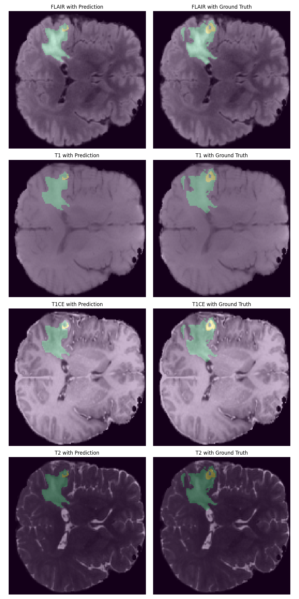

# GPU-Accelerated 3D Vision Transformer for Brain Tumor Segmentation
This is the next stage in my GPU/ML learning journey (see [Real-Time-Webcam-Image-Classification](https://github.com/EricJeong05/Real-Time-Webcam-Image-Classification) for my first project!) where I try and tackle more complex subjects (going from 2D -> 3D images) and work through the entire ML pipeline starting from data preprocessing -> model creation & tuning -> training -> inference -> performance optimization and GPU acceleration!  

## 1 . Visualize the BraTs data to first understand what the data looks like
I used the 2021 BRaTS dataset for this project ([Kaggle link](https://www.kaggle.com/datasets/dschettler8845/brats-2021-task1)). The first step I wanted to do was just see what this dataset even looked like since I've never worked with MRI data before. To do this, view_interactive_4pane_brats.py script loads all 4 of the modalities (T1, T1CE, T2, FLAIR) into one plot and overlays the segmentation masks on top of each to show where the tumor is. 

This script is interactive so that when you use your mouse scroll wheel to scroll up & down, it goes through the slices (z-axis) of the MRI volume.

**<ins>Here's a slice of the volume visualized:</ins>**


## 2. Preprocess the data
The next step is to preprocess the dataset to get it ready for feeding it into the model. For this project I'm preprocessing it in a way that it can be both fed into a UNet model (CNN-based) and a SwinUNETR model (transformer-based). I'm doing this because I want to get experience working with both types of models and I'm curious on how each of model type peforms and how much I can push them.

To allow support for both these models and ease of re-use between them, I've opted to go for a preprocessor script that runs independetly and takes the entire BRaTS dataset, does all of the deterministic preprocessing "offline," and stores each sample in a tensor (.pt) format for easy and quick loading during training.

**<ins>The preprocessing steps include:</ins>**

1. Adding channel dimension
2. Reorient volume to standard axis convention (RAS: Right, Anterior, Superior)
3. Resample to isotropic voxel spacing (e.g., 1mm × 1mm × 1mm) using linear interpolation for images and nearest-neighbor for labels
4. Normalize intensities to 0-1 range per modality
5. Foreground crop to remove empty black space and resize all volumes to 128x128x128
6. Convert labels 0,1,2,4 → 0,1,2,3 for ease of use
7. Ensure labels are int64 (not float64) for training
8. Save as PyTorch tensors (.pt)

**<ins>After preprocessing, the volume looks like such:</ins>**


## 3. Train UNet Model for Baseline DICE
Now once all the preprocessing is complete and we have all the .pt tensors saved, I'm first training a basic 3D U-Net model. The basic UNet architecture is shown below and it was pretty cool to learn about how it all works.


My UNet model has 5 layers, with each layer halving the image size while doubling the channel count, with 2 residual units at each layer.

During each training step, I applied random real-time augmentations to every input tensor to improve training performance. These augmentations include:

1. Random flips (axis-wise)
2. Random rotations (90deg)
3. Random gaussian noise

My training/val/test split was 80/10/10 from the entire Kaggle dataset. I trained the UNet for 200 epochs, with each epoch having 1000 samples to train on, and saved the model with the best DICE score since it's not guarenteed that the most recently trained model provides the best DICE score. Then I loaded in the saved best performing model and ran it through the test dataset and here are the results:

### Results
```python
Total training time: 7.453 hrs

Best Train Dice Score: 0.7633
Train Loss: 0.2496
Val Loss: 0.2990

Test Dice Score: 0.7616
Test Loss: 0.2947
```

As shown in the test DICE score and Loss, it does perform a bit worse compared to the training data, perhaps signaling overfitting to training data, but this is pretty good! State of the art UNet models can reach over DICE scores of 90%+, but as this is a very basic/simple UNet model with limited hardware resources, this is pretty good.

**Total time for training: 7.453 hrs**

Here is a plot of the training and validation loss + DICE score over all the epochs to see how the model faired during training:


I wanted to try and improve this model and try and push it as far as I can. The following improvements have been made to both improve training time and overall performance
1. cudnn_checkpointing enabled 
2. gradient accumulation steps = 4
3. DataLoader: prefetch_factor=None, num_workers=8, pin_memory=True, persistent_workers=True
4. Non-blocking transfers to GPU
5. Adam optimizer with fused implementation
6. Clear GPU cache after validation
7. Learning rate scheduler: WarmupCosineSchedule

Applying these changed and training the model for 200 epochs as before yielded the following results:

### Results
```python
Total training time: 2.796 hrs

Best Train Dice Score: 0.7487
Train Loss: 0.0634
Val Loss: 0.3142

Test Dice Score: 0.7550
Test Loss: 0.3044
```

As you can see, the training time sped up by a factor of around +2.66x while the test DICE score only got a -0.0066 decrease!

Below is a prediction on one of the samples it made compared to the ground truth (all modalities):


To try and bump up DICE scores, I'm trying 5-fold CV with ensembling at inference. Keeping the epochs at 200 per fold:

### Results
```python
Total training time: 5.948 hrs

Fold 1 Best Dice: 0.7288
Fold 2 Best Dice: 0.7305
Fold 3 Best Dice: 0.7349
Fold 4 Best Dice: 0.7656
Fold 5 Best Dice: 0.7249

Ensemble Test Dice Score: 0.7601
Ensemble Test Loss: 0.2934
```

This definitely provided an improvement (+0.005 DICE)!

## 4. Train SwinUNETR model and compare with UNet
Now I'm moving on to train a transformer-based model and compare my Unet results to a state-of-the-art transformer model. From my research, it looks like the best performing one on the BRaTS dataset so far is the SwinUNETR model developed by NVIDIA. The overall architecture is depicted as such:


Based on the report from the NVIDIA team, their SwinUNETR model achieved DICE scores of 0.91+. However, I don't expect to reach anywhere near that since they used a DGX-1 cluster of 8 V100 GPUs over 800 epochs of training time. While I'm over here working with a meagly 1 NVIDIA GeForce RTX 4060 Ti GPU with 8 GBs of dedicated GPU RAM on my personal PC. Their hardware allowed them to use sample sizes of 128x128x128 and feature sizes of 48 per stage - and with transformers, usually larger models = better performance. 

Since I'm VERY limited in terms of the hardware I have, I'm going to need to make some tradeoffs in terms of model configuration:

1. Image size = 96x96x96
2. Feature size = 24
3. Batch size = 1 (same as NVIDIA)
4. Use torch AMP (automatic mixed precision) to decrease model size
5. Num Workers = 8 for DataLoader parallelization
6. Persistent workers for DataLoader
7. Gradient accumulation = 4 to simulate larger batches
8. Gradient checkpointing for forward activations to reduce memory usage
9. cuDNN benchmarking to automatically test for the best convolutional kernels 
10. Clear GPU cache after each validation stage
11. WarmupCosineSchedule to improve learning rate

Training the out-of-the-box SwinUNETR model from MONAI using these settings for 80 epochs (was going to run 100, but computer crashed... but it looks like it was plateouing anyway) resulted in the following results for the best model saved & again I used the best performing model to run it through the test set as we did with the UNet model. Here are the results:

### Results

```python
(80 Epochs of data)

Total training time: 33.19 hrs 

Best Train Dice Score: 0.7220
Train Loss: 0.0781
Val Loss: 0.3431

Test Dice Score: 0.7249
Test Loss: 0.3379
```


Below is the same sample predicted by the SwinUNETR model to compare with UNet:



As you can see, it performed slightly worse than the UNET model, missing areas of predictions that the UNET model was able to achieve. Usually, UNETs perform better with limited hardware and smaller datasets while transformers perform better with beefier hardware and larger datasets allowing for scale. Therefore, I expect the UNet to perform better or equal to the SwinUNETR model since I'm very limited with my consumer grade hardware. But I'm going to try and improve it as much as possible.

## 5. GPU Acceleration
Now, the most obvious thing here is the training time and how long that takes compared to the lightweight UNET model. Even with the smaller image & feature size plus all the other acceleration methods, the fastest my model got was around 1-1.1s/iterations for training. And while this speed is pretty reasonable for transformer models with my GPU specs, trying to run at this speed for 1000 iterations x 100+ epochs adds up quick.

I want to try and reduce this as much as possible so that I can train more models quickly and try out different configurations and method to improve my DICE score. Currently, it takes several days to train one model and that's way too slow for me.

Inspecting my model during training:

**<ins>PyTorch Profiler<ins>**

Running the profiler on my training loop, you can see that the biggest bottlenecked kernels are:

Softmax + Softmax Backward, Dropout + Dropout Backward, and matmul in attention


**<ins>NVIDIA Nsight<ins>**

This is also backed up in NSight since zooming into one pass operation, the largest sections are the Softmax, Dropout, and matrix operations.


So since the biggest bottlenecks are the attention operations, my plan is to create a new [custom_swin_unetr.py](models/custom_swin_unetr/custom_swin_unetr.py) class that inherts from the base MONAI SwinUnetr class and modifies the attention operation within the WindowAttention class to use [FlashAttention](https://github.com/Dao-AILab/flash-attention) or something similar. Flash attention fuses QK^T + Softmax + @V into a single kernel in a clever way using tiling, online softmax, and other memory management operations to significantly reduce kernel launch overhead and speed up the attention calculations. Everything else is kept the same.

PyTorch has a version of this already available through torch.nn.functional.scaled_dot_product_attention that automatically uses Flash Attention on compatible GPUs and falls back to other efficient methods of attention calculation if not. I believe that the limitations of Flash Attentions prevents it from being used in SwinUnetr operations currently due to the relative position bias, so its most likely using SDPBackend.EFFICIENT_ATTENTION which is still an improvement from normal PyTorch operations (through things like kernel fusion).

**CUSTOM SWINUNETR**
```python
# Use PyTorch's fused scaled_dot_product_attention
# PyTorch will automatically select the best available backend:
# 1. Flash Attention 2 (fastest, if available)
# 2. Memory-efficient attention (xFormers-style)
# 3. Math attention (fallback)
with torch.nn.attention.sdpa_kernel(
    [SDPBackend.FLASH_ATTENTION, SDPBackend.EFFICIENT_ATTENTION, SDPBackend.MATH]
):
    x = F.scaled_dot_product_attention(
        q, k, v,
        attn_mask=attn_mask,
        dropout_p=self.attn_drop.p if self.training else 0.0,
        scale=self.scale
    )

x = x.transpose(1, 2).reshape(b, n, c)
x = self.proj(x)
x = self.proj_drop(x)
return x
```

**ORIGINAL MONAI SWINUNETR**
```python
attn = q @ k.transpose(-2, -1)
attn = self.softmax(attn)
attn = self.attn_drop(attn).to(v.dtype)

x = (attn @ v).transpose(1, 2).reshape(b, n, c)
x = self.proj(x)
x = self.proj_drop(x)
```

Running this version on 100 epochs results in the following:
### Results

```python
Total training time: 16.6435 hrs

Best Train Dice Score: 0.7199
Train Loss: 0.0780
Val Loss: 0.3471

Test Dice Score: 0.7250
Test Loss: 0.3379
```

As you can see, this resulted in almost a 2x speedup compared to using the out-of-the-box MONAI SwinUnetr model (probably even more since that run crashed at 80 epochs!) while keeping loss & DICE scores pretty much the same.

## 6. Maximizing DICE for SwinUNETR
Now that I have a much faster training model, I want to try and push up the DICE score as much as possible. There are certain areas where I think I can easily change, like using the AdamW optimizer instead of base Adam to help prevent overfitting and generalize better. Also I'm using a 5-fold cross validation training & inference ensembling method here as well to try improve DICE scores. I'm starting with 50 epochs per fold since I'm resource limited and I just want to see if this method even provides any improvement at inference time:

### Results

```python
Total training time: 50.01 hrs

Fold 1 Best Dice: 0.6823
Fold 2 Best Dice: 0.6886
Fold 3 Best Dice: 0.6937
Fold 4 Best Dice: 0.6592
Fold 5 Best Dice: 0.6950

Ensemble Test Dice Score: 0.7171
Ensemble Test Loss: 0.3488
```


Hmm, not much improvement compared to single fold. Trying 100 epochs per fold and pushing it to the limit:

### Results

```python
Total training time: 74.50 hrs

Fold 1 Best Dice: 0.7020
Fold 2 Best Dice: 0.7227
Fold 3 Best Dice: 0.7222
Fold 4 Best Dice: 0.7344
Fold 5 Best Dice: 0.7059

Ensemble Test Dice Score: 0.7326
Ensemble Test Loss: 0.3247
```


Defintely an improvement (+0.02 DICE)! But this is still less than the UNet model, so it looks I'm hitting the limit of my current implementation and hardware.

## Summary

In the end, the UNet model ultimately outperformed the SwinUNETR model, achieving a best test DICE score of **0.7601** (with 5-fold CV ensemble) compared to SwinUNETR's **0.7326** (with 5-fold CV ensemble) on my consumer-grade hardware (RTX 4060 Ti with 8GB VRAM). Implementing and testing these two fundamentally different deep learning architectures for the task of 3D brain tumor segmentation helped me learn a lot about building a end-to-end machine learning pipeline, model architecture selection, practical/hardware constraints vs theoretical performance, and what tradeoffs need to be made. So, using my learnings from this experience, below are the reasons why I believe the UNet model performed better than the SwinUNETR model even though SwinUNETR should be better on paper:

1. **Hardware Limitations**: My single consumer GPU severely constrained the SwinUNETR's capacity. NVIDIA's research achieved 0.91+ DICE scores using 8 V100 GPUs with 128×128×128 images and 48 feature dimensions, but I was limited to 96×96×96 images with only 24 feature dimensions due to memory capacity.

2. **Dataset Scale**: Transformers scale better with massive datasets and longer training runs. With  mylimited computational resources restricting training to 100-200 epochs (NVIDIA used 800 epochs), the transformer couldn't leverage its architectural advantages. I could have theoretically ran more tests using more epochs, but the training time would just explode.

3. **Architectural Efficiency**: UNet's convolutional backbone is inherently more parameter-efficient for 3D medical imaging at smaller scales. The hierarchical encoder-decoder structure with skip connections proved extremely effective for capturing both local and global features without requiring the massive model capacity that transformers need.

4. **Training Speed**: UNet trained approximately **12.5x faster** (5.95 hours for 5-fold CV vs 74.5 hours for SwinUNETR), allowing for more experimentation and hyperparameter tuning within the same time budget.

## Extra: Trying to Build my Own Custom Fused Attention Kernel
I wanted to originally try and create my own custom fused-kernel that contains QK^t + Softmax + *V all in one kernel to reduce the repeated, expensive kernel launch overhead, but I wasn't able to get the speedup I wanted (
the closest I got was only as half as fast as PyTorch's implementation...) and ultimately abandonded this idea and used torch.nn.functional.scaled_dot_product_attention instead. But through this, I learned a lot in the process about different ways to make the attention mechanism more performant!

Here's what I did:

1. ✅ Start with creation of naive attention kernel that takes in the input tensor and computes self-attention (attn = q @ k.transpose(-2, -1)). Validate with PyTorch output.

2. ✅ Upgrade naive attention kernel using shared memory tiling **(resulted in a 6x speedup of initial naive kernel!)**

3. ✅ Add softmax kernel + attn @ v kernel
